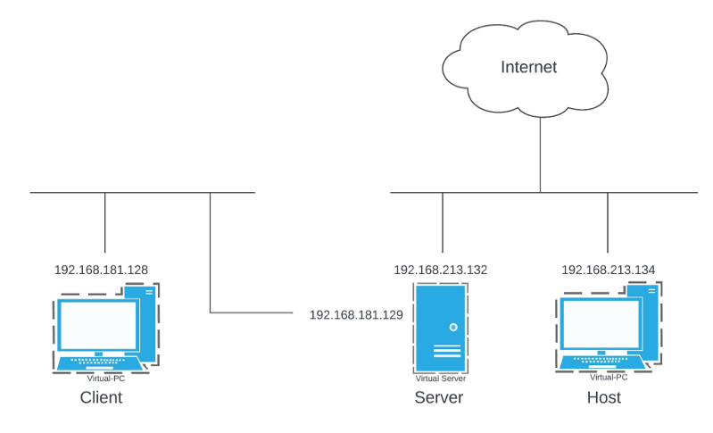

# VPN (Virtual Private Network) Client and Server in C


## Prerequisites
Two Ubuntu virtual machines with sudo access.

## Virtual Machines Preparation

1. On the client machine change the network adapter setting to "Host-Only".
2. On the server machine change the network adapter setting to "NAT" and add a second network adapter "Host-Only".
3. Install the following on both machines:
     * OpenSSL (```sudo apt install openssl libssl-dev```)
     * GCC (```sudo apt install gcc```)
     * net-tools (```sudo apt install net-tools```)
4. Create the necessary certificates using [this guide](https://blog.devolutions.net/2020/07/tutorial-how-to-generate-secure-self-signed-server-and-client-certificates-with-openssl/) (steps 1 & step 2) and store them on the corresponding machines:
     * Server machine - `server.key` and `server.crt`
     * Client machine - `ca.crt`


## VPN Server

The VPN server accepts incoming VPN client connections, providing a secure communication channel using SSL/TLS encryption.


### Configuration and Usage

1. Clone this repository to the server virtual machine.
2. Change the parameters in the `server_config.txt` file to match your machine.
3. Compile the `vpn_server.c` file in the terminal:
      ```bash
      gcc vpn_server.c -o vpn_server.out -lssl -lcrypto
      ```
4. Run the executable in the terminal of the virtual machine:
      ```bash
      sudo ./vpn_server.out
      ```


## VPN Client

The VPN client establishes a secure tunnel to a remote VPN server, allowing encrypted communication over an insecure network using SSL/TLS encryption.


### Configuration and Usage

1. Clone this repository to the client virtual machine.
2. Change the parameters in the `client_config.txt` file to match your machine.
3. Compile the `vpn_client.c` file in the terminal:
      ```bash
      gcc vpn_client.c -o vpn_client.out -lssl -lcrypto
      ```
4. Run the executable in the terminal of the virtual machine:
      ```bash
      sudo ./vpn_client.out
      ```
      
## Demo



[](https://youtu.be/UkEm_6yKbV8 "vpn demo")


## Behavioral Guidelines

The VPN server works with only one client currently.


